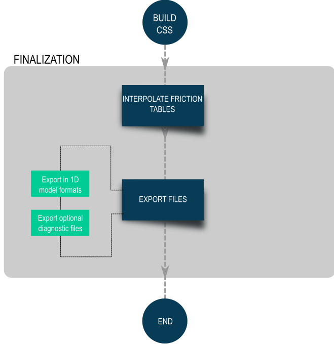

# Methodology

This chapter describes in more detail the steps FM2PROF takes to go from
a 2D representation of reality to a 1D representation of reality.
Conceptually, FM2PROF works in three distinct steps: (1) initialisation,
(2) building cross-sections and (3) finalisation.

## Initialisation

<figure markdown="span">
  { width="300" }
  <figcaption>Image caption</figcaption>
</figure>

The initialisation step involves parsing (i.e. reading and making
available for further analysis) the input. In this step control
volumes and sections are defined as well. This step may take some time
to complete, but this preprocessing greatly reduces the computation
times in the next step.

### Region polygon file

The region polygon file (*Dutch: gebiedsvakken*) is provided in the configuration and should be a valid [MultiPolygon geojson file](../api/#fm2prof.polygon_file.MultiPolygon). If a polygon file is provided, FM2PROF will perform an `inpolygon` algorithm during initialisation and write the results to a `.region_cache.json` file which is placed in the same directory as the 2D map file. This can take up to 30 minutes for a sizable river. If a cache file is already present and valid, it will be read instead. A cache file is invalidated if the 2D input has changed since the cache was created. 

!!! note

    There are special conditions for the geojson file, see [MultiPolygon](../api/#fm2prof.polygon_file.MultiPolygon). 

The region file is used to map each point (node, edge or face) in the 2D input grid to one
unique region. They are used to determine what 2D points are assigned to which cross-section, see [Classification of volumes](#Classification-of-control-volumes)

### Section polygon file

The section polygon file (*Dutch: gebiedsvakken*) is provided in the configuration and should be a valid [MultiPolygon geojson file](../api/#fm2prof.polygon_file.MultiPolygon). If a polygon file is provided, FM2PROF will perform an `inpolygon` algorithm during initialisation and write the results to a `.section_cache.json` file which is placed in the same directory as the 2D map file. This can take up to 30 minutes for a sizable river. If a cache file is already present and valid, it will be read instead. A cache file is invalidated if the 2D input has changed since the cache was created. 

[Sections](../glossary/sections) are used to divide the cross-section between floodplain and main channel (e.g. the 'floodplain' section and the 'main channel' section). This distinction is only used to assign different roughness values to each section. 

!!! tip

    The default section is "floodplain1". To reduce initialisation time, provide only a section polygon
    covering the main channel (so a polygon with attribute `section` set to `main`). By default, all 
    points not covered by the main channel will be floodplain1. 

### Import 2D data

#### Parsing 2D data

Dflow2d uses a staggered grid to solve the (hydrostatic) flow equations.
Because of this staggered approach, there is not a single 2D point that
has all information. Flow information (flow velocity, discharge) is
stored in *flow links* (or edges), while geometry (bed level) is stored
in *cell faces*. FM2PROF needs both information from the faces, as from the links.

<figure markdown="span">
  { width="300" }
  <figcaption>The dflow2d staggered grid.</figcaption>
</figure>

#### Classification of control volumes

`Control volumes` are used to define
which 2D datepoints are linked to which 1D cross-section. This is done
in the following steps:

-   Each 2D point (node, edge and face) is assigned a [Region](../glossary/Region). If a [region polygon](#Region-polygon-file) is provided, each 2D point is assigned the same region as the polygon they are in. If no region polygon is provided, each point will be assigned to the same default region. 
- Each cross-section is assigned a region following the same principle. 
- For each region seperately, we perform [nearest neighbour classification](../api/nearest_neighbour) to uniquely identify each 2D point to a 1D cross-section. Only 2D points that have the same region as the cross-section can be assigned to a cross-section. 

#### Classification of sections

[Sections](../glossary/sections) are used to output a
different roughness function for the main channel and the floodplains.
The purpose of the classification is to determine whether a 2D point
belongs to the main channel section, or to the floodplain section (see
warning below).

Two methods are implemented:

-   `Variance based classification<section_classification_variance>`{.interpreted-text
    role="ref"}
-   Polygon-based classification

## Build Cross-Section

<figure markdown="span">
  { width="300" }
  <figcaption>The dflow2d staggered grid.</figcaption>
</figure>

Once initialisation is complete, will loop over each
`cross-section location<Cross-section location>`{.interpreted-text
role="term"}. In each iteration, the program takes two steps: (1)
building the geometry and (2) building the roughness tables.

!!! warning

    No cross-section will be generated for locations that have no 2D data
    assigned or have less than 10 faces assigned. This may happen if a
    location lies outside the 2D grid, or if there are many cross-section
    closely together. If this happens, an error is raised by FM2PROF. The
    user should check the cross-section location input file to resolve the
    problem.

### Build Geometry

In each loop, a number of steps is taken based on the 2D data that is
uniquely assigned to that cross-section:

-   `Lakes`{.interpreted-text role="term"} are identified using the
    `identify_lakes`{.interpreted-text role="ref"}
-   `Flow volume`{.interpreted-text role="term"} and
    `Storage volume`{.interpreted-text role="term"} are seperated using
    the `distinguish_storage`{.interpreted-text role="ref"}
-   The
    `water level dependent geometry<Water level (in)dependent geometry>`{.interpreted-text
    role="term"} is computed using `wl_dependent_css`{.interpreted-text
    role="ref"}
-   The
    `water level independent geometry<Water level (in)dependent geometry>`{.interpreted-text
    role="term"} is computed using
    `wl_independent_css`{.interpreted-text role="ref"}
-   The parameters for `Summerdikes`{.interpreted-text role="term"} are
    defined using the `sd_optimisation`{.interpreted-text role="ref"}
-   Finally, the cross-section is simplified using the
    Visvalingam-Whyatt method of poly-line vertex reduction
    `simplify_css`{.interpreted-text role="ref"}

### Build roughness

At each cross-section point, a roughness look-up table is constructed
that relates water level (in m + NAP) to a Chézy roughness coefficient.
This is done in three steps:

-   For each section, a roughness table is constructed by averaging the
    2D points

## Finalisation

<figure markdown="span">
  { width="300" }
  <figcaption>The dflow2d staggered grid.</figcaption>
</figure>

### Interpolate friction tables

Some output formats (e.g. SOBEK 3) require that the friction tables are uniform
for each branch: each point on the branch must have the same dimensions. This means
that if friction is defined as a function of water level, that each point on a branch must have
the same water level dimension. 

During cross-section generation, it is not yet known what the water levels are for each 
point. During finalisation, a uniform water level dimension is defined. For each point on 
the branch, the friction value is interpolated to the uniform dimension. 

### Export output files

Output files are written to the required 1D format. Optionally, additional files are written as well. 
These optional output files can be enabled in the `debug` section of the configuration file. 
