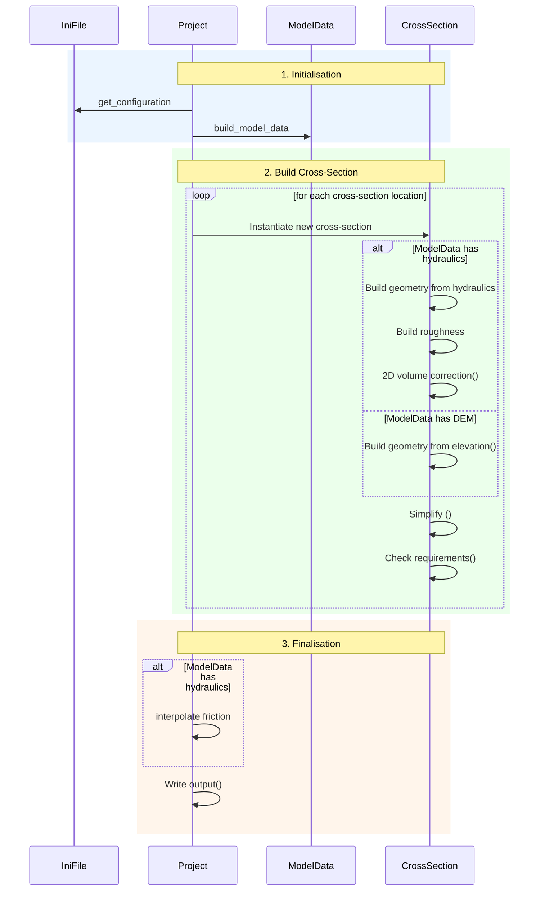
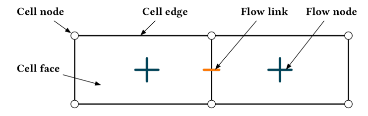
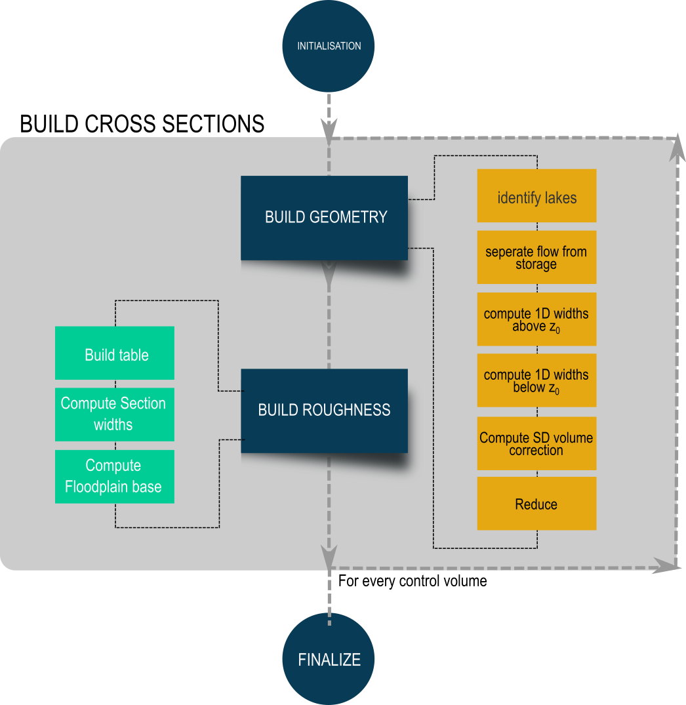

# Methodology

This chapter describes the methodology behind `Project.run()`. FM2PROF operates in three distinct steps: (1) initialisation, (2) cross-section construction, and (3) finalisation.

Depending on the data provided, some steps are skipped or replaced with an alternative method — for example, when only a DEM is available instead of full hydraulic data. The diagram below summarises the overall workflow.

## Initialisation

The initialisation step parses the input — that is, it reads the data and prepares it for further analysis. Control volumes and sections are also defined during this step. Although initialisation can take some time, this preprocessing greatly reduces computation time in the next step.

### Build ModelData

The `ModelData` class holds all input data. In this step, all data is loaded, validated, and pre-processed. Both the pre-processing and subsequent computations depend on whether the [2D Data](../user_docs/input_files.md#2d-data) includes hydraulic data or consists of a DEM only.

#### Parsing 2D hydraulic data

Delft3D FM 2D uses a staggered grid to solve the (hydrostatic) flow equations. Because of this staggered approach, no single 2D point holds all the required information: flow data (flow velocity, discharge) is stored on *flow links* (edges), while geometry (bed level) is stored on *cell faces*. FM2PROF therefore needs data from both faces and links.

<figure markdown="span">
  { width="300" }
  <figcaption>The dflow2d staggered grid.</figcaption>
</figure>

*Face* data (bed levels) is used to construct geometry, while *edge* data is used to derive roughness.

#### Classification of control volumes

`Control volumes` define which 2D data points are linked to which 1D cross-section. This is done as follows:

- Each 2D point (node, edge, and face) is assigned a [region](glossary.md#regions). If a [region polygon](#region-polygon-file) is provided, each 2D point is assigned the region of the polygon it falls within. If no region polygon is provided, all points are assigned to the same default region.
- Each cross-section is assigned a region following the same principle.
- For each region separately, [nearest-neighbour classification](api.md#nearest_neighbour) uniquely assigns each 2D point to a 1D cross-section. Only 2D points sharing the same region as a cross-section can be assigned to it.

#### Classification of sections

[Sections](glossary/md#sections) are used to output separate roughness functions for the main channel and the floodplains. The purpose of this classification step is to determine whether a 2D point belongs to the main channel section or the floodplain section (see warning below).

Two methods are implemented:

- Variance-based classification
- Polygon-based classification

## Build Cross-Section

<figure markdown="span">
  { width="300" }
  <figcaption>The process if hydraulic data is present</figcaption>
</figure>

Once initialisation is complete, FM2PROF loops over each [cross-section location](../user_docs/input_files.md#cross-section-locations).

!!! warning

    No cross-section is generated for locations with no assigned 2D data, or with fewer than 10 assigned faces. This can happen if a location lies outside the 2D grid, or if several cross-sections are located too close together. In such cases, FM2PROF raises an error. Check the cross-section location input file to resolve the problem.

### Build Geometry

#### Steps with hydraulic data

For each loop iteration, the following steps are performed on the 2D data uniquely assigned to that cross-section:

- [Lakes](../tech_docs/glossary.md#lakes) are identified using the [lake identification method](../tech_docs/numerical_methods.md#lake-identification).
- [Flow volume](../tech_docs/glossary.md#flow-volume) and [storage volume](../tech_docs/glossary.md#storage-volume) are separated using the [conveyance-storage separation method](../tech_docs/numerical_methods.md#conveyance-storage-separation).
- The water-level-dependent geometry is constructed from the water level / flow volume table.
- The water-level-independent geometry is extrapolated from the lowest water level down to the bed level.
- A 2D volume correction is carried out to compute the volume behind the [summer dikes](../tech_docs/glossary.md#summerdikes).

#### Steps with DEM data

If only DEM data is available, the geometry is constructed by iterating from the highest bed level to the lowest. For each bed level, the combined area of all cells at or below the current level is computed, producing a level-area table. Widths are then obtained by dividing area by cross-section length.

#### Final steps

Finally, the cross-section is simplified using the [Visvalingam–Whyatt method of poly-line vertex reduction](../tech_docs/numerical_methods.md#simplification).

### Build roughness

This step runs only if hydraulic data is provided. At each cross-section point, a roughness lookup table is constructed relating water level (in m + NAP) to a Chézy roughness coefficient.

This is done in three steps:

- For each section, a roughness table is constructed by averaging the 2D points

## Finalisation

### Interpolate friction tables

This step is performed only when hydraulic data is present.

Some output formats (e.g. SOBEK 3) require friction tables to be uniform across each branch: every point on a branch must share the same dimensions. In practice, this means that if friction is defined as a function of water level, every point on a branch must use the same water-level dimension.

During cross-section generation, the water levels at each point are not yet known. During finalisation, a uniform water-level dimension is defined, and the friction value at each point on the branch is interpolated onto this uniform dimension.

### Export output files

Output files are written in the required 1D format. Optionally, additional output files can be written as well; these can be enabled in the `debug` section of the configuration file. 
