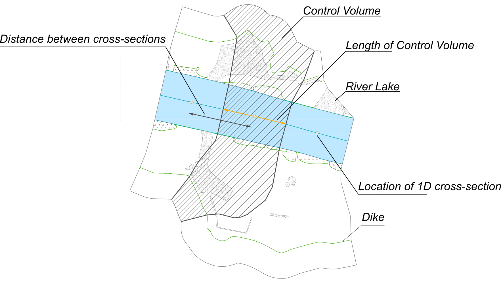
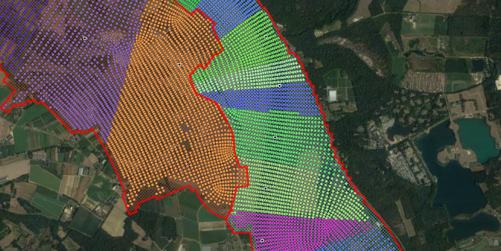

# Important concepts

## Control volume

A control volume is a bounded area that describes a section of 
a 2D model that is assigned to a 1D cross-section. The figure
below shows a schematical overview. 

Control volumes are a conceptual concept and not defined in their 
own right. Instead, all relevant 2D data, such as bed levels, 
flow velocities and roughness information is assigned to a 
cross-section by k-Nearest Neighbour classification. As such,
the bounds of the control volumes are not uniquely defined by 
a polygon but rather by a collection of points. 

Control volumes use the 2D coordinates of each cross-section as
specified in the CrossSectionLocationFile during the nearest-neighbour 
classification. The 2D input data used during classification is 
filtered by [region](#regions) in the following way: a cross-section within 
a certain region can only be assigned 2D information from that region. 

The `CrossSectionLocationFile` additionally contains information on the 1D 
coordinates (branch and chainage) and the length. 
The figure below shows how cross-section length
is defined. We recommend that this file is generated using the 
[GenerateCrossSectionLocations](../user_docs/utils/GenerateCrossSectionsLocations.md) 
tool.

An approximation of the control volumes is generated by the program
during the finalisation step. This is a convex hull approximation, 
which is usefull for debugging input errors (see [Troubleshooting](../user_docs/troubleshooting.md)) 

!!! note

    Control volumes are the equivalent of WAQ2PROF's sobekvakken

<figure markdown="span">
  { width="300" }
  <figcaption>A control volume</figcaption>
</figure>

## Regions

Regions are used to have some finer control over which 2D model
output is assigned to which 1D cross-section. If no region are
defined, 2D model output is assigned to cross-section using
k-nearest neighbour. This is not always a good approach, for example
if a tributary or retention area. In the figure a section of the
River Meuse is plotted near the [Blitterswijck retention
area](https://www.openstreetmap.org/search?query=blitterswijck#map=16/51.5405/6.1122).
The retention area is demarcated from the main river by levees.
Cross-sections generated for the retention area should therefore not
'eat out of' the area of the main channel - which could results in
a small cross-section non-physical constriction of the flow.

<figure markdown="span">
  { width="300" }
  <figcaption>Region polygons are used to prevent cross-sections generated
    in the retention area to 'eat out of' the main channel. Within each
    region polygon (red borders) nearest neighour is used to assign 2D
    points to cross-sections. Points with the same color are associated with
    the same 1D cross-section</figcaption>
</figure>

## Sections

Sections are used to divide the cross-section between floodplain and
main channel (e.g. the 'floodplain' section and the 'main channel' section). This distinction is only used to assign
different roughness values to each section.

## Water level (in)dependent geometry

It is often not possible to start the 2D computation from a
completely dry bed - instead some initial water level is present in
the model. This initial condition divides the 1D geometry in water
level dependent part and a water level independent part. Below the
initial condition, we cannot take advantage of the 2D model to tell
us which cells are part of the conveyance and which cells are wet.
Instead, the water level is artificially lowered in a number of
steps to estimate the volume below the initial water levels.

## Summerdikes

Summerdikes are a Dutch term for levees that are designed to be
flooded with higher discharges, but not with relatively low floods
(i.e.: they withstand summer floods). They contrast with
'winterdikes', which are designed to not flood at all. Summerdikes
effectively comparimentalise the floodplain. They can have a
profound effect on stage-discharge relationships: as these levees
overflow the compartments start flowing which leads to a retention
effect. Such an effect cannot be modelled using regulare
cross-sections. SOBEK therefore has a 'summerdike' functionality.

## Lakes

Lakes are water bodies that are not hydraulically connected to the
main channel in the first few timesteps of the 2D model computation.
They do not contribute to the volume present in the control volume
until they connect with the rest of the river and will not feature
in the water level independent computation. 
Water bodies that *are* connected to the main channel
in the first few timesteps **do** count as volume. However, as these
likely do not contribute to conveyance, they will be flagged as
'storage' instead.

<figure markdown="span">
  { width="300" }
  <figcaption></figcaption>
</figure>

## Total volume

The Total volume refers to the volume of water \[in m\^3\] within a
`Control volume`{.interpreted-text role="term"} for a given water
level at the `Cross-section location`{.interpreted-text
role="term"}. The total volume is the sum of the
`Flow volume`{.interpreted-text role="term"} and the
`Storage volume`{.interpreted-text role="term"}.

## Flow volume

The Flow volume is defined as the volume of water \[in m\^3\] for
which the conditions for flowing water are met. This volume is
considered to be available for the conveyance of water through the
`Control volume`{.interpreted-text role="term"}.

See `distinguish_storage`{.interpreted-text role="ref"}

## Storage volume

The Storage volume is defined as the volume of water \[in m\^3\] for
which the conditions for flowing water are not met. Storage volume
does not contribute to conveyance, but serves only for water
retention. Examples include groyne fields and

See `distinguish_storage`{.interpreted-text role="ref"}

## Total width

See `Total volume`{.interpreted-text role="term"}

## Flow width

See `Flow volume`{.interpreted-text role="term"}

