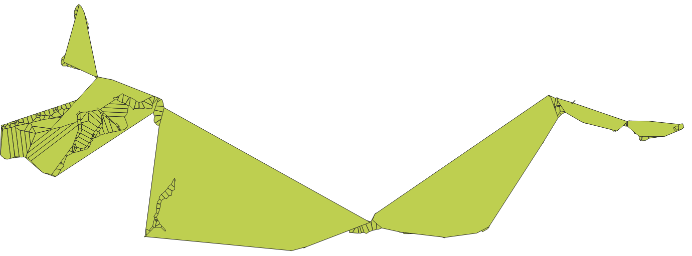
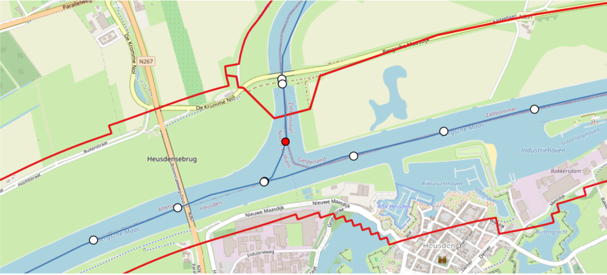
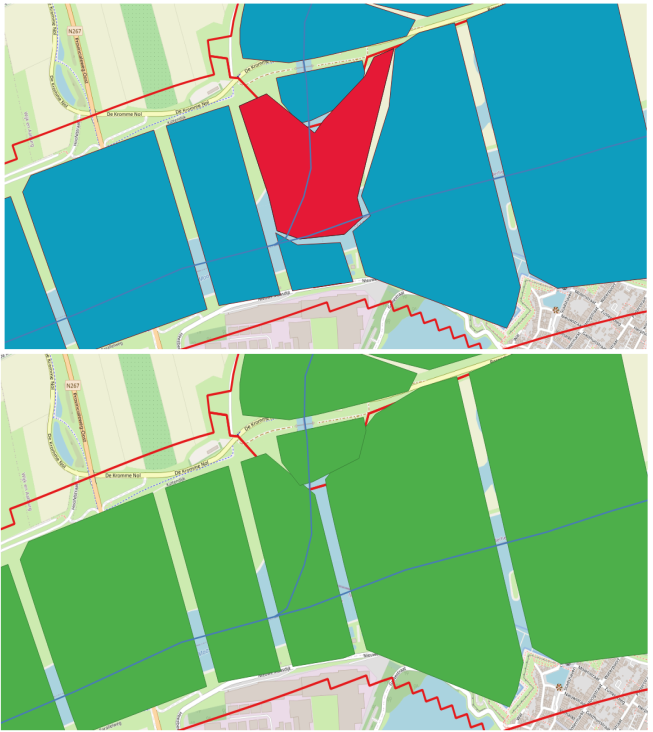

# Troubleshooting common problems

## Cross-section volumes

One of the output files is a geojson file called `cross_section_volumes.geojson`. 
This file can be opened and visualised using common GIS software, for
example QGIS. This file contains convex hull approximation of the 
[control volumes](../tech_docs/glossary.md#control-volume). 

A good file has cleary delineated polygon within each [region](../tech_docs/glossary.md#region). 
Common problems that can be spotted by visualising this file
are detailed below. 

### Problem: Large overlapping polygons

Cross-section that do not fall within a single region polygon get assigned to 
the [`default region`](configuration.md#exec-1--defaultregion). If you 
are using regions, it is highly recommended to make sure all cross-section
locations are within a single region polygon. 

It is therefore usually by mistake that some locations are assigned the 
[`default region`](configuration.md#exec-1--defaultregion). Visually,
this often results in something like the figure below. 

<figure markdown="span">
  { width="300" }
  <figcaption>This may indicated that there are some cross-sections that fall outside of any one region</figcaption>
</figure>

### Problem: Cross-section in wrong region

A [region](../tech_docs/glossary.md#region) is used to prevent side-branches from limiting
the cross-sectional volume of the main channel. Users should take care to 
make sure that all cross-section locations lie within the appropriate region. The figure below shows an example where this is not the case. 

<figure markdown="span">
  { width="300" }
  <figcaption>The user has a dedicated region polygon for the side channel and
  main channel. The red cross-sectional location lies on the side-branch but 
  falls in the region polygon of the main channel. This is a common error, and can
  be resolved by excluding this cross-section in the 
  branch rule file. </figcaption>
</figure>

To fix this problem, users can add a rule and/or exclusion to the [branch rule file](utils/GenerateCrossSectionsLocations.md#fm2prof.utils.GenerateCrossSectionLocationFile--branch-rule-file). 

<figure markdown="span">
  { width="300" }
  <figcaption> Above: the cross-section location in the wrong region results 
  in a constrained main channel, resulting in erroneous back-water effects. The 
  red filled polygon should be removed by excluding the corresponding
  cross-section location.  
  Below: correct polygons after excluding the cross-section location. </figcaption>
</figure>

## Log file

The log file is saved in the output folder as `fm2prof.log`. By default, 
a new FM2PROF run will append (not overwrite) to an already existing log. 

### Errors 

Errors are serious problems with the configuration or input data. Errors
during the initialisation process will lead to FM2PROF cancelling the run. 

Errors during cross-section generation will not crash the run, but will 
prevent the cross-section that generated the error from being created. 

!!! warning

    There should be no errors at the end of the run. All errors should be remedied. 

### Warnings

Warning may point to a problem the user should fix, but can sometimes be safely
ignored. In all cases, we recommend that users inspect the warning message to 
understand whether or not it can be ignored. Below are come common warnings. 

| Warning message | Phase | Explanation | 
| ----------------| ------------| ---------- |
| <x\> overlaps <y\> | Initialisation | Region or section polygons overlap. Overlapping polygons are not a problem in itself, but may lead to ambiguity if a cross-section location falls within two regions.|

