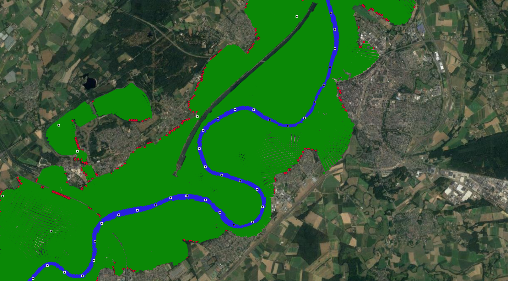

Advanced topics
====================

.. _terminology:

Terminology
^^^^^^^^^^^^^^^^^^^^^
.. glossary::

    Region
        Regions are used to have some finer control over which 2D model output is assigned to which 1D cross-section. If no region are defined, 2D model output is assigned to cross-section using k-nearest neighbour. This is not always a good approach, for example if a tributary or retention area. In the figure a section of the River Meuse is plotted near the `Blitterswijck retention area <https://www.openstreetmap.org/search?query=blitterswijck#map=16/51.5405/6.1122>`_. The retention area is demarcated from the main river by levees. Cross-sections generated for the retention area should therefore not 'eat out of' the area of the main channel - which could results in a small cross-section non-physical constriction of the flow.  

        .. figure:: ../figures/region_polygon_blitwijk.PNG
            :align: center
            :alt: alternate text
            :figclass: align-center
            :width: 100%

            Region polygons are used to prevent cross-sections generated in the retention area to 'eat out of' the main channel. Within each region polygon (red borders) nearest neighour is used to assign 2D points to cross-sections. Points with the same color are associated with the same 1D cross-section. 

        
    Section
        Section are used to divide the cross-section between floodplain and main channel (e.g. the 'floodplain' section and the 'main channel' section). This distinction is only used to assign different roughness values to each section. 

    Water level (in)dependent geometry
        It is often not possible to start the 2D computation from a completely dry bed - instead some initial water level is present in the model. This initial condition divides the 1D geometry in water level dependent part and a water level independent part. Below the initial condition, we cannot take advantage of the 2D model to tell us which cells are part of the conveyance and which cells are wet. Instead, the water level is artificially lowered in a number of steps to estimate the volume below the initial water levels. 

    Summerdikes
        Summerdikes are a Dutch term for levees that are designed to be flooded with higher discharges, but not with relatively low floods (i.e.: they withstand summer floods). They contrast with 'winterdikes', which are designed to not flood at all. Summerdikes effectively comparimentalise the floodplain. They can have a profound effect on stage-discharge relationships: as these levees overflow the compartments start flowing which leads to a retention effect. Such an effect cannot be modelled using regulare cross-sections. SOBEK therefore has a 'summerdike' functionality. See :ref:validation_summerdike for the effect of summerdikes on the volume graph. 

    Control volume
        A control volume of a cross-section is the geographical part of the 2D model that is associated with that cross-section. Contol volumes are assigned by k-Nearest Neighbour classification. 

        .. figure:: ../figures/controlvolume.png
            :align: center
            :alt: alternate text
            :figclass: align-center
            :width: 50%

            A control volume

    Lakes
        Lakes are water bodies that are not hydraulically connected to the main channel in the first few timesteps of the 2D model computation. They do not contribute to the volume present in the control volume until they connect with the rest of the river and will not feature in the :term:`water level independent computation<Water level (in)dependent geometry>`. Water bodies that *are* connected to the main channel in the first few timesteps **do** count as volume. However, as these likely do not contribute to conveyance, they will be flagged as 'storage' instead. 

        .. figure:: ../figures/gis_visualisation_maas_03_annotated.png
            :align: center
            :alt: alternate text
            :figclass: align-center
            :width: 50%

.. _diagnosis:

Diagnosing output
^^^^^^^^^^^^^^^^^^^^^

After running |project|, it is important to check its output. In this section we provide some steps to diagnose and interprete your model results. In short, the steps are the following:

1. Check the log for errors & warnings 
2. Visualising output
3. Comparing model results

.. tip::

    |project| output consists of:

        - SOBEK 3 format files (`geometry.csv`, `roughness.csv`)
        - DFlow1D format files (`CrossSectionLocations.ini`, `CrossSectionDefinitions.ini`, etc. )
        - diagnosis files (`fm2prof.log`, `volumes.csv`, `cross_section_volumes.geojson`)
        - optional diagnosis files (see the `ExportMapFiles` parameter)
        - the log file (fm2prof.log)

1. Checking the log 
....................

|project| logs to the console and to a file. By default, they do not show the same information: messages flagged as `debug` are not written to screen by default (but they are to file). The log is written to the output directory as `fm2prof.log` by default. The log first prints the configuration used during the run. You can use this to reproduce your results later one. 

.. hint::

    It is good practice to open the log and `Ctrl-F` search for warnings and errors. Warnings alert the user on possible input error (e.g. overlapping polygons), but that do not prevent execution of the problem, and may even not affect the output adversely. Errors should not be ignored, but resolved. 

In general, the log consists of the following sections:

.. code-block:: text

    2020-07-23 15:55    INFO    0% T+ 0.04s Opening FM Map file
    2020-07-23 15:55    INFO    0% T+ 0.28s Closed FM Map file
    2020-07-23 15:55    INFO    0% T+ 0.28s Opening css file
    2020-07-23 15:55    INFO    0% T+ 0.28s Closed css file
    2020-07-23 15:55    INFO    0% T+ 0.28s All 2D points assigned to the same region and classifying points to cross-sections
    2020-07-23 15:55    INFO    0% T+ 0.34s Assigning point to sections without polygons
    2020-07-23 15:55    INFO    0% T+ 0.35s finished reading FM and cross-sectional data data
    2020-07-23 15:55   DEBUG    0% T+ 0.35s Number of: timesteps (169), faces (360), edges (654)

If |project| fails in this section, the initialisation or files may not be loaded properly. This phase may take some minutes for large models, especially if regions and sections are used. 

.. tip::

    The number of faces and edges corresponds to the 2D grid cells. They greatly determines the initialisation time. For example, the initialisation step for the Meuse model (face count: 353,882) take about 60-70 seconds. 

    The number of timesteps determines the time for each cross-section to be derived (next section). 

Next, the program will loop through all the cross-sections. A single iteration may look like this (debug information is cropped out):

.. code-block:: text

    2020-07-23 15:55    INFO    0% T+ 0.36s Starting new task: case1_0
    2020-07-23 15:55    INFO    0% T+ 0.66s Initiated new cross-section
    2020-07-23 15:55    INFO    0% T+ 0.87s Retrieving centre point values
    2020-07-23 15:55    INFO    0% T+ 0.88s Identifying lakes
    2020-07-23 15:55    INFO    0% T+ 1.49s Seperating flow from storage
    2020-07-23 15:55    INFO    0% T+ 2.04s Computing cross-section from water levels
    2020-07-23 15:55    INFO    0% T+ 2.04s Computing cross-section from bed levels
    2020-07-23 15:55    INFO    0% T+ 2.07s correction finished
    2020-07-23 15:55    INFO    0% T+ 2.07s Cross-section reduced from 173 to 20 points
    2020-07-23 15:55    INFO    0% T+ 2.08s Computed roughness
    2020-07-23 15:55    INFO    0% T+ 2.08s Cross-section case1_0 derived in 1.73 s

.. tip::
    
    If each cross-section takes a long time to derive, the number of output timesteps in your 2D model may be too large. Each cross-section in the Meuse model take < 2 second to be derived. 

Finally the program will finish:

.. code-block:: text 

    2020-06-05 08:04    INFO    0% T+ 692.61s Starting new task: Finalizing
    2020-06-05 08:04    INFO    0% T+ 692.61s Interpolating roughness
    2020-06-05 08:04    INFO    0% T+ 692.68s Export model input files to ../Maas_dir/Output/maas_default_settings\test19
    2020-06-05 08:04    INFO    0% T+ 698.96s Exported output files, FM2PROF finished
    2020-06-05 08:04    INFO    0% T+ 698.97s Export geojson output to ../Maas_dir/Output/maas_default_settings\test19
    2020-06-05 08:04   DEBUG    0% T+ 698.99s Collected points, dumping to file
    2020-06-05 08:04   DEBUG    0% T+ 729.79s Done
    2020-06-05 08:04   DEBUG    0% T+ 729.86s Collected points, dumping to file
    2020-06-05 08:05   DEBUG    0% T+ 773.85s Done

.. hint::
    
    The Meuse pilot model take about 13 minutes to produce 1D input. 

2. Visualising output 
......................

There are various ways to visualise |project| output. 

With utils.VisualiseOutput
---------------------------

First, the `fm2prof.utils` module provides a class to directly load and visualise the output:

.. code-block:: python

    from fm2prof import utils

    output_dir = 'tests\Output\RunWithFiles_Output\case_05_dyke\CaseName01'

    viz = utils.VisualiseOutput(output_dir)

    for css in viz.cross_sections():
        # This creates a directory 'figures' in output_dir
        viz.make_figure(css)

This produces figures in the output directory. 

.. figure:: ../figures/interprete_figure.png
    :align: center
    :alt: alternate text
    :figclass: align-center
    :width: 100%

    Example interpretation of a ` fm2prof.utils.VisualiseOutput`  figure for testcase :ref:`validation_summerdike`. 

The shape of the volume graph depends on the shape of the geometry:

.. figure:: ../figures/volume_graphs_types.png
    :align: center
    :alt: alternate text
    :figclass: align-center
    :width: 50%

    The shape of the volume graph for given geometries

For most real-world rivers, the volume graphs will follow a compound 'trapezoidal' model, with one or several 'compartimentalisation' effects. 

With GIS software
---------------------------

A second way to visualise is with GIS software (such as QGIS). By default two files can be readily loaded in GIS software: the cross-section input file (which is a text delimited format) and the `cross_section_volumes.geojson` file. The latter is a convex-hull approximation of the control volumes (see :ref:`terminology`).

.. figure:: ../figures/gis_visualisation_maas_01.png
    :align: center
    :alt: alternate text
    :figclass: align-center
    :width: 100%

    Visualisation of the cross-section location (input) file and the convex-hull approximation of the control volumes (cross_section_volumes.geojson). The overlap of the polygons follows from the convex hull approximation - overlap is not actually possible.  

Closer inspection is possible by setting `ExportMapFiles` to `True` in the configuration file. Note that this an create really large files. 

.. tip::

    For inspecting one or just a few cross-sections, use the `CssSelection` parameter to limit the output. 

.. figure:: ../figures/gis_visualisation_maas_02.png
    :align: center
    :alt: alternate text
    :figclass: align-center
    :width: 100%

    Visualisation of the actual assignment of 2D points to cross-sections using nearest-neighbour approximation. (note: region polygons were used here)

.. figure:: ../figures/gis_visualisation_maas_03.png
    :align: center
    :alt: alternate text
    :figclass: align-center
    :width: 100%

    Visualisation of the (automatically classified) :term:`lakes`. Be aware of the specific definition of 'lake'. Water bodies that are hydraulically connected to the main channel at low water depths are not flagged as 'lake'. 

    Visualisation of the roughness section. The red dots are 2D points that were not within any polygon in the `SectionPolygonFile`. These are automatically added to the main section. This will yield a warning in the log file. In general it is a good idea to expand the polygons to cover all files. 

Recommended settings
^^^^^^^^^^^^^^^^^^^^^^^^^^

The recommendations detailed in this section are based on the Meuse River pilot project. 

LakeTimesteps
    This parameter defines the amount of 2D model timesteps used to determine if a wet cell is hydraulically connected to the main channel. It recommended to only deviate from the default value if lakes are misidentified, and to generally keep the number low. A good test to set the value for this parameter is to visualise the 'IsLake' attribute (see :ref:`diagnosis`). Too high values lead to overestimation of the total volume: everything that is identified as 'main channel' will be used in the so-called 'water-level independent' part of the geometry identification. 

MinimumTotalWidth
    The purpose of this parameter is to prevent instabilities in 1D Solvers if they are presented with a (near) zero width. It is recommended to keep this value small (at default). 

ClassificationMethod
    This parameter defines the method used to classify the region and section of each output point in the 2D output. |project| has built-in classification method. However these methods are not efficient for large models. The currently supported 'DeltaShell' method consists of a manual work-around. 

    .. note:: 
        This approach is not well documented as it involves some manual work. We expect to automise this and make it more user friendly in a future update. 

AbsoluteVelocityThreshold / RelativeVelocityThreshold 
    These thresholds are used to distinguish conveyance (effective flow) from storage (dead zones) areas. Parts of the cross-section that do not contribute to flow are called 'storage area'. A cell is considered part of the flow area if all of the following conditions are met:

        - the water depth is higher than 0
        - the (depth-averaged) velocity is larger than `AbsoluteVelocityThreshold`
        - the (depth-averaged) velocity is larger than `RelativeVelocityThreshold` multiplied by the average velocity in the cross-section

    These conditions are checked for each timestep in the 2D model output.

SkipMaps
    This parameter is used to skip the first number of output timesteps ('maps') in the 2D model output. This parameter can be useful if the 2D model is not completely in equilibrium at the start of the computation (e.g. falling water levels in the first few timesteps). However, it tests have shown that it is far better to carefully initialize the 2D model, than to skip the first few steps with this parameter. 

ExportMapFiles
    If this parameter is set to `True`, |project| will output two additional geojson files. These additional files contain diagnostic information for each 2D model output (e.g. to which cross-section a 2D point is assigned). However, for large models this output can be quite large. For detailed diagnosis, combine this parameter with `CssSelection`

CssSelection
    This parameter is used to run |project| for a subset of cross-sections in the `CrossSectionLocationFile`. Its main use is for diagnostic purposes. For example, if you want to closely inspect the 54th, 76th and 89th cross-section, use:

    .. code-block:: text
    
        CssSelection = [54, 76, 89]
        ExportMapFiles = True

